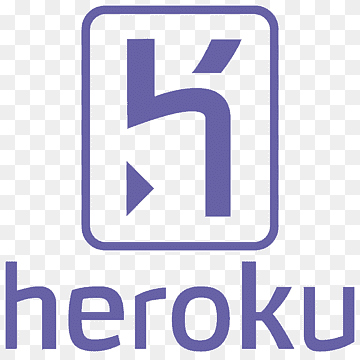
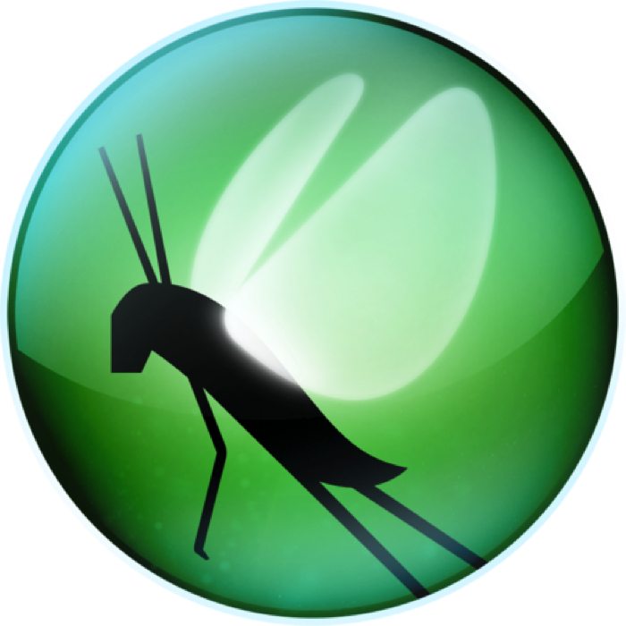

  <h1> Flask - Heroku - Locust </h1>
  
  
  
    
  

This app is a basic flask app which is created for educational purposes. 

## Goals of the task 
- Understanding how it works
- How to properly create a github repository 
- How to deploy applications
- How to perform overload tests

## General Information
- This is basic website with two endpoints. One of these is responsible for display "Hello World!" text. 
The second endpoint display basic Form which display Hello + "Your name" after typing this in textbox.
- For deploy an application I used Heroku platform.
- Performing overload tests were done by Locust framework.

## Technologies Used
- [PyCharm Community](https://www.jetbrains.com/pycharm/download/#section=windows) - version 2023.1
- [Python](https://www.python.org/downloads/release/python-390/) - version 3.9.0
- [Heroku](https://id.heroku.com)
- [Locust](https://locust.io/) - version 2.15.1

## Creator
>Created by [Piasta](https://github.com/Piasta/).
